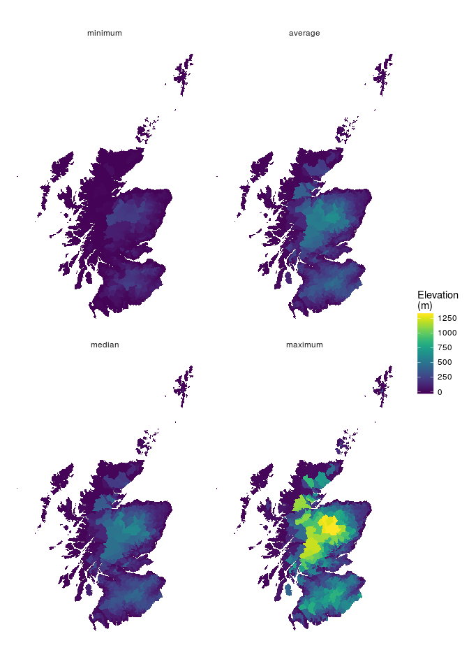
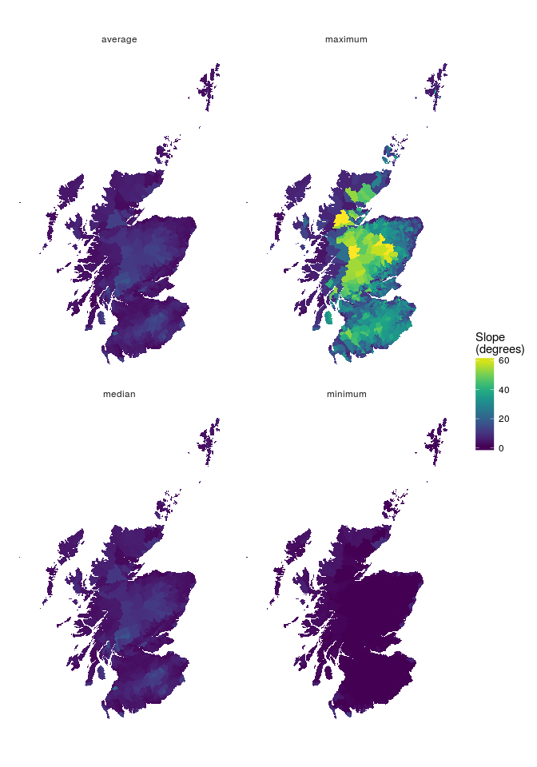

Defining hill farming
================
Mike Spencer
16 April 2018

Introduction
------------

### Purpose

### Output level

Will be agricultural parishes. 2016 data, downloaded from: <https://data.gov.uk/dataset/939fdd5e-7322-4ab7-9dc9-bbfc538c4477/agricultural-parishes>.

    ## OGR data source with driver: GPKG 
    ## Source: "/home/mspencer/Cloud/Michael/SRUC/hill_farms/data/spatial/ag_parishes_2016.gpkg", layer: "simplified_parishes"
    ## with 932 features
    ## It has 4 fields

There are 886 agricultural parishes in Scotland. Why report at ag parish level?

Defining hill farming
---------------------

Data were collected from a variety of sources:

-   Urban/rural: <http://www.gov.scot/Publications/2018/03/6040/downloads>
-   Elevation: <https://www.ordnancesurvey.co.uk/business-and-government/products/terrain-50.html>
-   SNH LCA Landscape Character Assessment: <https://gateway.snh.gov.uk/natural-spaces/>
-   SNH Wild land: <https://gateway.snh.gov.uk/natural-spaces/>
-   JHI LCA Land capability for agriculture: <http://www.hutton.ac.uk/learning/natural-resource-datasets>
-   JHI LCA Land capability for forestry: <http://www.hutton.ac.uk/learning/natural-resource-datasets>
-   Agricultural census **rough grazing - to do**: RESAS

<!-- -->

    ## Warning: Column `PARName` joining factor and character vector, coercing
    ## into character vector

    ## Warning in `[<-.factor`(`*tmp*`, list, value = 0): invalid factor level, NA
    ## generated

    ## Warning in `[<-.factor`(`*tmp*`, list, value = 0): invalid factor level, NA
    ## generated

Preparation of these datasets extracted data at an agricultural parish level. Exact specification for this process is detailed in:

-   `grass_read.R` which reads files into GRASS GIS
-   `grass_analysis.R` clips polygon data to agricultural parishes and measures subsequent polygon sizes. Terrain values (elevation and slope) are also extracted from raster data.
-   `read_hill_class.R` combines data from the GRASS analysis and aggregates to parish levels. Crucially, at a parish level proportion of land is reported as being less viable, i.e. higher proportions mean a parish is more likely to be hill farming.

### Urban rural

Agricultural parishes cover the entire land mass of Scotland, so some are predominantly urban areas. Below is a map showing the proportion of each parish which is classified as rural in the two fold urban-rural classification.

Urban-rural classification does not make a distiction between upland and lowland areas, but a remoteness index of how long it takes to travel (by driving) to the nearest town. Hence, it does not represent the ease or challenge of farming in a given parish. It does, however give an indication of proximity to market.

### Terrain

A digital elevation model was used to get terrain data for each parish. These were for elevation and slope and values extracted were minimum, mean, median and maximum.

#### Elevation

#### Slope

### SNH LCA Landscape Character Assessment

The following have been taken from the SNH landscape character assessment level 3 as hill farming:

    ##                                                                   Potential_hill_farming_areas
    ## 1  Flat or Rolling, Smooth or Sweeping, Extensive, High Moorlands of the Highlands and Islands
    ## 2                                                                                  Inland Loch
    ## 3                                                                             Highland Straths
    ## 4                                Moorland Transitional Landscapes of the Highlands and Islands
    ## 5                       High, Massive, Rolling, Rounded Mountains of the Highlands and Islands
    ## 6                                              High Massive Mountain Plateau of the Cairngorms
    ## 7                                                                 Smooth Upland Moorland Hills
    ## 8                                                                           Highland Foothills
    ## 9                 Upland Igneous and Volcanic Hills The Ochil, Sidlaw, Cleish and Lomond Hills
    ## 10                   High, Massive, Rugged, Steep-Sided Mountains of the Highlands and Islands
    ## 11                                                      Sea Lochs of the Highlands and Islands
    ## 12                                                Highland and Island Rocky Coastal Landscapes
    ## 13                                           Peatland Landscapes  of the Highlands and Islands
    ## 14                                                Rocky Moorlands of the Highlands and Islands
    ## 15         Rugged, Craggy Upland Hills and Moorlands of the Highlands, including the Trossachs
    ## 16                                              Low Coastal Hills of the Highlands and Islands
    ## 17                                              Coastal Hills Headlands Plateaux and Moorlands
    ## 18                                                                               Lowland Hills
    ## 19                                                              Foothills and Pronounced Hills
    ## 20                                             Upland Hills, The Southern Uplands and Cheviots
    ## 21                                                                      High Plateau Moorlands
    ## 22                                                                      Rugged Granite Uplands
    ## 23                                                                      Rocky Volcanic Islands
    ## 24                                                                       Rugged Moorland Hills
    ## 25                                                                      Upland Fringe Moorland
    ## 26                                    Upland Hills, The Lammemuir, Pentland and Moorfoot Hills
    ## 27                                               Rocky Coasts Cliffs and Braes of the Lowlands
    ## 28                                                     Knock or Rock and Lochan of the Islands
    ## 29                                                                             Highland Cnocan

### SNH Wild land

### JHI LCA Land capability for agriculture

### JHI LCA Land capability for forestry

Ranking to create an index of hill farming
------------------------------------------
